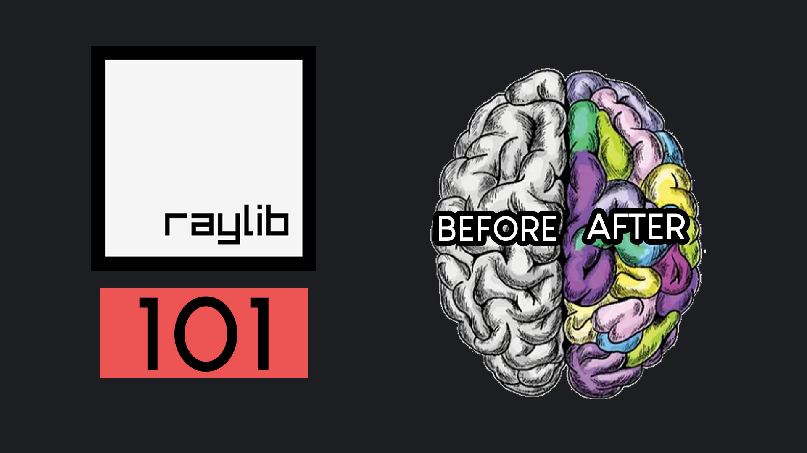

# Get Started in raylib in 20 minutes - C++
Welcome to the easiest introduction to game development with raylib in C++. If you're new to raylib, you're in the right place to start your journey. In this video, I will guide you through the installation process of raylib on your Windows computer and we are going to build a simple raylib project from scratch. We'll be using C++ with Visual Studio Code to develop a basic raylib program featuring a keyboard-controlled ball. The entire procedure is very easy and should take no more than 20 minutes.

# How to use this project
1. Double click on the main.code-workspace file. This will open the project in VS Code.
2. From the Explorer Window of VS Code navigate to the src folder and double click on the main.cpp file.
3. Press F5 on the keyboard to compile and run the program.
4. Watch the video which explains every line of the code.

# Video Tutorial

  

🎥 <a href = "https://youtu.be/RGzj-PF7D74">Video Tutorial on YouTube</a>

 
 

| 📺 <a href="https://www.youtube.com/channel/UC3ivOTE5EgpmF2DHLBmWIWg">My YouTube Channel</a>
| 🌍 <a href="http://www.educ8s.tv">My Website</a> |  

